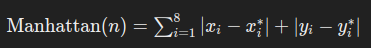
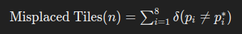

# Relatório de Comparação de Métodos de Busca no 8-Puzzle

## 1. Introdução

O **8-puzzle** é um quebra-cabeça deslizante que consiste em um tabuleiro 3x3 com oito peças numeradas e um espaço vazio. O objetivo é reorganizar as peças a partir de um estado inicial até um estado final desejado, movendo as peças adjacentes ao espaço vazio.

Este relatório tem como objetivo comparar dois algoritmos de busca:

- **A\***
- **Best-First Search**

Além disso, serão analisadas duas heurísticas distintas — **Manhattan Distance** e **Misplaced Tiles** — em dois níveis de aplicação (nível 1 e nível 2). A comparação será baseada no número de nós visitados, número de movimentos na solução encontrada e tempo gasto na execução.

## 2. Metodologia

### 2.1. Algoritmos de Busca

#### A\*
O algoritmo **A\*** combina a busca de custo mínimo (**g(n)**) com uma heurística (**h(n)**) para estimar o custo restante até o objetivo. Sua função de avaliação é definida como:

f(n) = g(n) + h(n)

**Características:**

- **Garantia de Otimalidade:** Se a heurística for admissível (nunca superestimar o custo real), o A\* encontrará o caminho ótimo.
- **Balanceamento:** Equilibra a exploração de caminhos promissores com a exploração de caminhos de baixo custo.

#### Best-First Search
O **Best-First Search** utiliza apenas a heurística (**h(n)**) para guiar a busca, priorizando os nós com menor valor heurístico.

**Características:**

- **Busca Gananciosa:** Foca em explorar os nós que parecem mais promissores com base na heurística.
- **Menos Informado:** Pode não encontrar o caminho ótimo, pois ignora o custo real já percorrido (**g(n)**).

### 2.2. Heurísticas Utilizadas

#### Manhattan Distance
Calcula a soma das distâncias horizontais e verticais que cada peça está do seu objetivo final.



**Vantagens:**

- Admissível e consistente.
- Mais informada que a heurística de peças fora do lugar.

#### Misplaced Tiles
Conta o número de peças que estão fora de suas posições corretas, ignorando a distância.



onde `delta` é 1 se a peça `Pi` está fora do lugar e 0 caso contrário.

**Vantagens:**

- Simples de implementar.
- Admissível, mas menos informada que Manhattan Distance.

### 2.3. Níveis de Heurística

- **Nível 1:** Calcula a heurística baseada apenas no estado atual.
- **Nível 2:** Calcula a heurística considerando os estados filhos imediatos e retorna o menor valor heurístico encontrado.

**Impacto:**

- **Nível 1:** Menor custo computacional, porém heurística menos informada.
- **Nível 2:** Heurística mais informada, podendo reduzir o número de nós visitados, porém com maior custo computacional.

### 2.4. Configuração dos Testes

- **Estado Inicial:**
    ```
    4 5 8
    7 0 3
    2 1 6
    ```

- **Estado Final:**
    ```
    1 2 3
    4 5 6
    7 8 0
    ```

Os testes foram realizados definindo manualmente o estado inicial e final para garantir consistência entre os diferentes métodos de busca.

## 3. Resultados

Os resultados obtidos para cada combinação de método de busca, heurística e nível são apresentados nas Tabelas 1 e 2.

### 3.1. Nível de Heurística 1

| Método de Busca | Heurística      | Nós Visitados | Movimentos | Tempo Gasto (s) |
|-----------------|-----------------|---------------|------------|------------------|
| **A\***         | Manhattan       | 186           | 20         | 0.1449           |
| **A\***         | Misplaced Tiles | 2986          | 20         | 2.7875           |
| **Best-First**  | Manhattan       | 446           | 60         | 0.4307           |
| **Best-First**  | Misplaced Tiles | 1062          | 144        | 0.9956           |

### 3.2. Nível de Heurística 2

| Método de Busca | Heurística      | Nós Visitados | Movimentos | Tempo Gasto (s) |
|-----------------|-----------------|---------------|------------|------------------|
| **A\***         | Manhattan       | 400           | 20         | 0.4016           |
| **A\***         | Misplaced Tiles | 5475          | 20         | 5.7450           |
| **Best-First**  | Manhattan       | 177           | 38         | 0.1705           |
| **Best-First**  | Misplaced Tiles | 545           | 112        | 0.5503           |

## 4. Análise dos Resultados

### 4.1. Comparação entre A\* e Best-First Search

- **A\* com Manhattan (Nível 1):** Visitou 186 nós, encontrou uma solução em 20 movimentos e levou 0.1449 segundos.
- **A\* com Misplaced Tiles (Nível 1):** Visitou significativamente mais nós (2986), mas ainda encontrou a mesma solução em 20 movimentos, consumindo 2.7875 segundos.

**Interpretação:** A heurística de Manhattan é mais informada e eficiente, resultando em menos nós visitados e menor tempo de execução em comparação com Misplaced Tiles.

- **Best-First com Manhattan (Nível 1):** Visitou 446 nós, encontrou uma solução em 60 movimentos e levou 0.4307 segundos.
- **Best-First com Misplaced Tiles (Nível 1):** Visitou 1062 nós, encontrou a solução em 144 movimentos e levou 0.9956 segundos.

**Interpretação:** Best-First Search com Manhattan foi mais eficiente que com Misplaced Tiles, mas ainda menos eficiente que A\* com Manhattan em termos de nós visitados e tempo.

### 4.2. Impacto dos Níveis de Heurística

- **A\* com Manhattan (Nível 2):** Visitou 400 nós, 20 movimentos e 0.4016 segundos.
- **A\* com Misplaced Tiles (Nível 2):** Visitou 5475 nós, 20 movimentos e 5.7450 segundos.

**Interpretação:** O aumento para nível 2 com Manhattan aumentou o número de nós visitados em relação ao nível 1 (186 para 400), mas manteve o mesmo número de movimentos. Entretanto, com Misplaced Tiles, o nível 2 resultou em um aumento substancial de nós visitados e tempo, possivelmente devido à natureza menos informada da heurística.

- **Best-First com Manhattan (Nível 2):** Visitou 177 nós, 38 movimentos e 0.1705 segundos.
- **Best-First com Misplaced Tiles (Nível 2):** Visitou 545 nós, 112 movimentos e 0.5503 segundos.

**Interpretação:** Para Best-First Search, o nível 2 com Manhattan reduziu ainda mais o número de nós visitados e tempo, mantendo um número razoável de movimentos. Com Misplaced Tiles, houve uma redução significativa nos nós visitados em comparação com o nível 1, mas um aumento nos movimentos e tempo.

### 4.3. Impacto das Heurísticas e Níveis

- **Manhattan vs. Misplaced Tiles:**  
A heurística Manhattan é mais informada, resultando em menos nós visitados e menor tempo de execução, especialmente no A*. Misplaced Tiles, sendo menos informada, leva a uma exploração mais extensa, aumentando o número de nós visitados e o tempo.

- **Níveis de Heurística:**  
O nível 2, que considera os estados filhos imediatos, tende a fornecer uma estimativa mais precisa, reduzindo o número de nós visitados. No entanto, isso pode aumentar o tempo de execução devido ao cálculo adicional. Essa troca é evidente especialmente com a heurística Misplaced Tiles, onde o nível 2 resultou em um aumento significativo no tempo de execução para o A*.

## 5. Conclusão

Os resultados demonstram que o algoritmo **A\*** com a heurística **Manhattan** e nível 1 oferece uma busca eficiente, encontrando soluções em um número reduzido de nós visitados e em menor tempo. A comparação com **Best-First Search** ressalta a vantagem do A* em termos de eficiência e otimalidade, especialmente quando uma heurística bem informada como Manhattan Distance é utilizada.

A aplicação do nível 2 da heurística mostrou-se benéfica para algumas combinações, melhorando a precisão das estimativas e reduzindo o número de nós visitados. Contudo, isso veio acompanhado de um aumento no tempo de execução, especialmente com a heurística Misplaced Tiles, evidenciando a importância de equilibrar precisão e desempenho.

Em suma, a escolha do algoritmo de busca, da heurística e do nível de aplicação deve considerar as especificidades do problema e os recursos computacionais disponíveis, buscando sempre um equilíbrio entre eficiência e precisão na solução encontrada.
